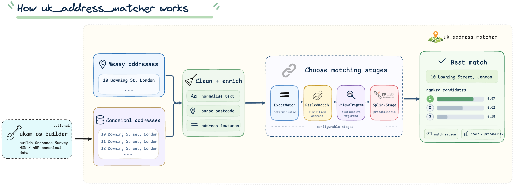

<p align="center">

</p>

[](https://pypi.org/project/uk_address_matcher/#history)
[](https://moj-analytical-services.github.io/uk_address_matcher/)

# High performance UK addresses matcher (geocoder)

Fast, simple address matching (geocoding) in Python.

For full documentation, see our [main documentation site](https://moj-analytical-services.github.io/uk_address_matcher/).

## Why use this library

- **Simple.** Setup in seconds, runs on a laptop. No separate infrastructure of services needed.
- **Fast.** Match 100,000 addresses in ~30 seconds.
- **Proven accuracy.** We use public, labelled datasets to measure and document accuracy.
- **Support for Ordnance Survey data.**  We provide a automated build pipeline for users wishing to match to Ordnance Survey data.  Matching to any other canonical dataset is also supported.

The end-to-end process of matching 100,000 addresses to Ordnance Survey data, including all software downloads and data processing takes:

- Less than a minute if you are matching to a small area such as a local council region.
- If matching to the whole UK, there's a one-time preprocessing step that takes around 10 minutes.  Subsequent matching of 100k records takes less than a minute.

## What does `uk_address_matcher` do?

`uk_address_matcher` finds the best known address for each address in your dataset.



- **\[OPTIONAL\]** - Construct Ordnance Survey canonical data using [ukam_os_builder](https://github.com/moj-analytical-services/ukam_os_builder). Skip this step if you already have a canonical dataset or are using another source.
- **Input:** provide a messy dataset, such as addresses typed by users, and a canonical dataset of known addresses. See the [input data requirements](https://moj-analytical-services.github.io/uk_address_matcher/get_started/#input-data-requirements).
- **Preparation:** addresses are cleaned, standardised, and enriched with useful features such as postcodes. See the [canonical dataset preprocessing guidance](https://moj-analytical-services.github.io/uk_address_matcher/get_started/#choose-whether-to-pre-process-your-canonical-dataset).
- **Matching:** configurable matching stages compare each messy address with candidate canonical addresses, from exact matches through to probabilistic matching with Splink. See [choosing a matching threshold](https://moj-analytical-services.github.io/uk_address_matcher/choosing_a_matching_threshold/#choosing-a-matching-threshold).
- **Output:** the best match, together with the match reason, match weight, and distinguishability score. See [choosing a matching threshold](https://moj-analytical-services.github.io/uk_address_matcher/choosing_a_matching_threshold/) for how to interpret these scores.

## Installation

```bash
pip install uk_address_matcher
```

## Inputs

You provide two datasets:

-  a "messy" dataset of addresses that you want to match
-  a "canonical" dataset of known addresses, often an Ordnance Survey dataset such as AddressBase or NGD.

The package will find the best matching canonical address for each messy address.

## Example:

Your address files need, at minimum, two columns: `unique_id` and `address_concat`.

`postcode` is optional by recommended. If not provided an attempt is made to parse them out of `address_concat`

Given the following data:

### Messy data

| unique_id | address_concat | postcode |
|----------|----------------|----------|
| m_1 | Flat A Example Court, 10 Demo Road, Townton | AB1 2BC |
| ...more rows |

### Canonical data

| unique_id | address_concat | postcode |
|----------|----------------|----------|
| c_1 | Flat A, 10 Demo Road, Townton | AB1 2BC |
| c_2 | Flat B, 10 Demo Road, Townton | AB1 2BC |
| c_3 | Basement Flat, 10 Demo Road, Townton | AB1 2BC |
| ...more rows |


You can match it as follows:

```python
import duckdb
from uk_address_matcher import AddressMatcher

con = duckdb.connect()
messy = con.read_csv("example_data/messy_example.csv")
canonical = con.read_csv("example_data/canonical_example.csv")

matcher = AddressMatcher(
    canonical_addresses=canonical,
    addresses_to_match=messy,
    con=con,
)
result = matcher.match()
result.matches().show(max_width=10000)
```

Example output:

| unique_id | resolved_canonical_id | original_address_concat | original_address_concat_canonical | match_reason | match_weight | distinguishability |
|----------|------------------------|-------------------------|-----------------------------------|--------------|--------------|--------------------|
| m_1 | c_2 | Flat A Example Court, 10 Demo Road, Townton | Flat A, 10 Demo Road, Townton | splink: probabilistic match | 13.5885 | 11.5033 |


## Development

The scripts and tests will run better if you create .vscode/settings.json with the following:

```json
{
    "jupyter.notebookFileRoot": "${workspaceFolder}",
    "python.analysis.extraPaths": [
        "${workspaceFolder}"
    ],
    "python.testing.pytestEnabled": true,
    "python.testing.unittestEnabled": false,
    "python.testing.pytestArgs": [
        "-v",
        "--capture=tee-sys"
    ]
}
```

